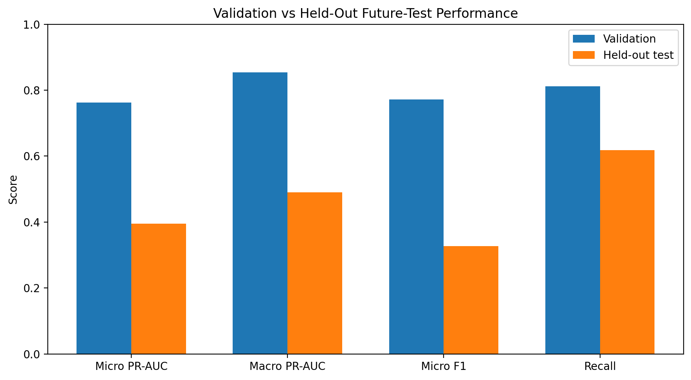
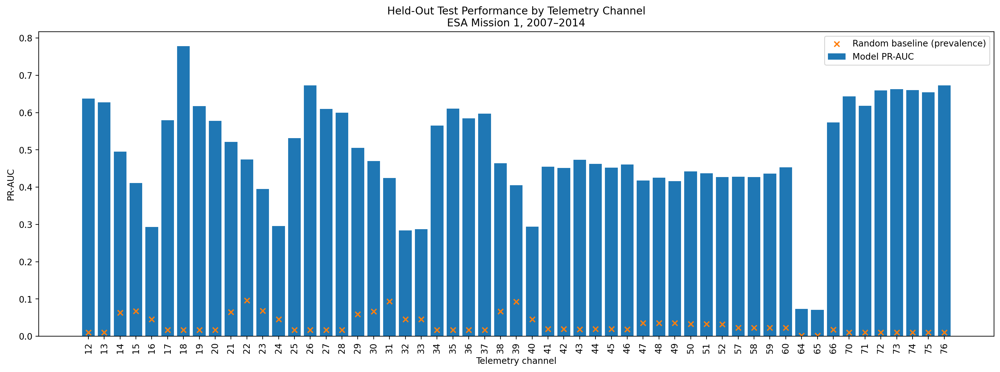
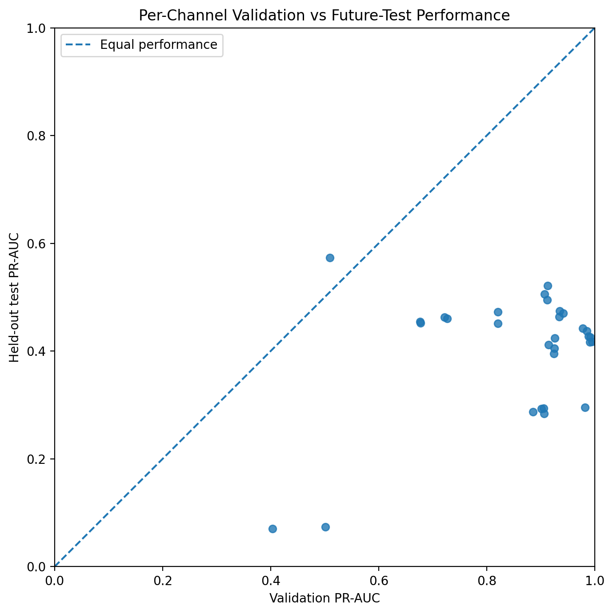
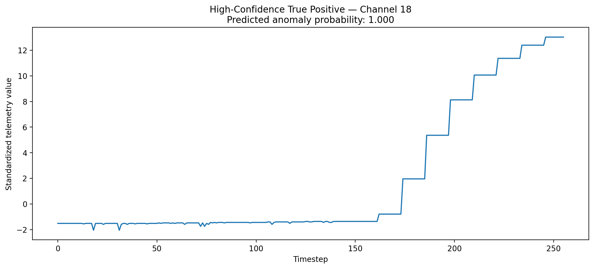

# spacecraft-telemetry-anomaly-detection
Multi-label anomaly detection on ESA Mission 1 spacecraft telemetry using CNN-based models, memory efficient preprocessing, and long-horizon temporal evaluation.

# Spacecraft Telemetry Anomaly Detection

Multi-label anomaly detection on ESA Mission 1 spacecraft telemetry using a hybrid CNN architecture, memory-efficient preprocessing, and long-horizon temporal evaluation.

## Overview

This project explores anomaly detection in real spacecraft telemetry from the European Space Agency's Mission 1 dataset.

The final system processes approximately **14.7 million timestamps across 76 telemetry channels** and predicts anomalies independently for **55 supervised target channels**.

The project focuses not only on model performance, but also on a practical challenge of real telemetry systems: **long-term distribution shift**. A model that performs strongly on a nearby validation period can degrade significantly when evaluated several years into the future.

## Dataset

The project uses **ESA Mission 1** from the ESA Anomaly Dataset, a real satellite telemetry dataset with curated anomaly annotations.

Key characteristics:

- 76 telemetry channels
- approximately 14.7 million timestamps after preprocessing
- telemetry spanning 2000–2014
- 58 official target telemetry channels
- anomaly annotations with channel-specific time intervals
- anomaly categories including `Anomaly`, `Rare Event`, and `Communication Gap`

For the supervised task, `Anomaly` and `Rare Event` annotations are treated as positive anomaly labels, while communication gaps are excluded.

Channels 61–63 contain no positive examples in the training period, so the final classifier predicts anomalies for **55 target channels** while using all 76 telemetry channels as input.

Dataset source: [ESA Anomaly Dataset](https://github.com/esa/anomaly-dataset)

ESA benchmark implementation: [ESA Anomaly Detection Benchmark](https://github.com/kplabs-pl/ESA-ADB)

## Preprocessing

The preprocessing pipeline follows the structure of the ESA Mission 1 data:

1. Load each telemetry channel independently.
2. Sort timestamps and remove duplicates.
3. First-difference monotonic channels 4–11.
4. Resample every channel to a regular 30-second grid using zero-order hold.
5. Merge all 76 telemetry channels.
6. Fill remaining channel boundary gaps.
7. Split the data chronologically.
8. Fit standardization statistics using normal training timestamps only.
9. Convert telemetry into overlapping windows.

The final window configuration is:

- **Window size:** 256 timestamps
- **Sampling interval:** 30 seconds
- **Window duration:** 128 minutes
- **Stride:** 128 timestamps / 64 minutes
- **Input shape:** `(256, 76)`
- **Target shape:** `(55,)`

A target channel is labelled anomalous when at least 10% of timestamps in the window overlap an annotated anomaly interval.

The 10% threshold is a project-specific modelling choice rather than an official ESA benchmark rule.

## Chronological Evaluation

The dataset is split chronologically to avoid future-data leakage:

| Split | Period |
|---|---|
| Training | before 2006-10-01 |
| Validation | 2006-10-01 to 2007-01-01 |
| Held-out test | after 2007-01-01 |

The held-out test period extends through 2014, creating a challenging long-horizon evaluation of model robustness.

## Model

The final model is a **Hybrid 1D CNN** with two complementary branches.

### Temporal CNN branch

Three 1D convolutional layers learn local temporal patterns across the 76 telemetry channels.

Global average pooling and global max pooling are used to summarize the learned temporal representation.

### Statistical branch

Four statistics are calculated for every input channel:

- mean
- standard deviation
- range
- mean absolute temporal difference

These features provide direct information about changes in signal level, variability, and temporal instability.

The CNN and statistical representations are concatenated and passed through a fully connected classifier producing **55 independent output logits**.

## Training

Training uses:

- `BCEWithLogitsLoss`
- per-channel positive-class weighting
- square-root softened inverse-frequency weights
- maximum positive weight of 20
- Adam optimizer
- learning rate `3e-5`
- batch size 32
- dropout 0.2
- random seed 42
- early stopping with patience 10

Model selection is based on the harmonic mean of **micro PR-AUC** and **macro PR-AUC**, referred to in this project as **Balanced PR-AUC**.

PR-AUC is used because anomalies are highly imbalanced.

## Architecture Comparison

The Hybrid CNN was compared against a CNN+GRU model using the same training protocol.

| Model | Micro PR-AUC | Macro PR-AUC | Balanced PR-AUC |
|---|---:|---:|---:|
| **Hybrid CNN** | **0.7624** | **0.8536** | **0.8054** |
| CNN + GRU | 0.7063 | 0.8396 | 0.7672 |

The Hybrid CNN achieved stronger validation performance across all three metrics and was selected as the final model.

## Results

### Validation

| Metric | Score |
|---|---:|
| Micro PR-AUC | **0.7624** |
| Macro PR-AUC | **0.8536** |
| Balanced PR-AUC | **0.8054** |
| Micro F1 | **0.7723** |
| Precision | **0.7366** |
| Recall | **0.8117** |

The global classification threshold selected on validation was:

```text
0.41265404
```

### Held-Out Future Test

The validation threshold was frozen before evaluating the post-2007 test period.

| Metric | Score |
|---|---:|
| Micro PR-AUC | **0.3949** |
| Macro PR-AUC | **0.4903** |
| Balanced PR-AUC | **0.4374** |
| Micro F1 | **0.3265** |
| Precision | **0.2218** |
| Recall | **0.6186** |

The significant validation-to-test decrease highlights the difficulty of long-term spacecraft telemetry generalization.



## Per-Channel Analysis

Aggregate metrics hide substantial variation between telemetry channels.

Several channels retain strong anomaly discrimination despite extremely low anomaly prevalence.

Examples from the held-out test period:

| Channel | Test PR-AUC | Prevalence |
|---|---:|---:|
| Channel 18 | **0.778** | 0.017 |
| Channel 76 | **0.673** | 0.010 |
| Channel 26 | **0.673** | 0.017 |
| Channel 73 | **0.663** | 0.011 |
| Channel 74 | **0.660** | 0.011 |

For channel 18, the model reaches approximately **45× the random PR-AUC baseline**.

Channels 64 and 65 perform poorly in absolute terms, but each contains only **two positive training windows**, providing almost no supervised signal.

Other channels contain thousands of positive training examples but still degrade strongly between validation and the future test period. This behavior is consistent with changes in telemetry distributions and operating regimes over the spacecraft lifetime.





## Example Detection

The following example shows a high-confidence true-positive detection from channel 18 in the held-out future test set.

The telemetry remains relatively stable for most of the window before a sequence of large level shifts occurs.



## Limitations

This project intentionally uses a simplified supervised formulation rather than reproducing the full ESA benchmark.

Important limitations include:

- evaluation is performed at the window/channel level rather than using ESA's official event-aware metrics;
- the 10% window anomaly threshold is a project-specific design choice;
- some target channels contain extremely few positive training examples;
- one global classification threshold is shared across all channels;
- the model is static and does not adapt to long-term changes in spacecraft telemetry.

The held-out results show that strong near-term validation performance does not necessarily guarantee reliable multi-year generalization.

## Future Work

Potential extensions include:

- continual or online model adaptation;
- explicit spacecraft operating-regime detection;
- domain adaptation for long-term telemetry shift;
- channel-specific probability calibration and thresholds;
- semi-supervised or unsupervised models for channels with very few anomaly labels;
- evaluation using the official ESA event-aware benchmark metrics.

## Repository Structure

```text
spacecraft-telemetry-anomaly-detection/
├── README.md
├── requirements.txt
├── LICENSE
├── src/
│   ├── dataset.py
│   ├── preprocessing.py
│   ├── supervised_CNN.py
│   └── autoencoder.py
├── notebooks/
│   └── spacecraft_anomaly_detection.ipynb
├── figures/
│   ├── test_pr_auc_by_channel.png
│   ├── validation_vs_test.png
│   ├── validation_vs_test_per_channel.png
│   └── detected_anomaly_channel_18.png
└── models/
```
Large telemetry arrays and raw ESA dataset files are intentionally not included in the repository.

## Running the Project

1. Clone the repository.

```bash
git clone https://github.com/ninplu/spacecraft-telemetry-anomaly-detection.git
cd spacecraft-telemetry-anomaly-detection
```

2. Install dependencies.

```bash
pip install -r requirements.txt
```

3. Download ESA Mission 1 from the official ESA Anomaly Dataset and place it in:

```text
ESA-Mission1/
```

4. Open the notebook:

```text
notebooks/spacecraft_anomaly_detection.ipynb
```

The preprocessing pipeline generates the required intermediate NumPy arrays locally.

## References

- European Space Agency, **ESA Anomaly Dataset**
- Kotowski et al., **European Space Agency Benchmark for Anomaly Detection in Satellite Telemetry**
- ESA Anomaly Detection Benchmark implementation

